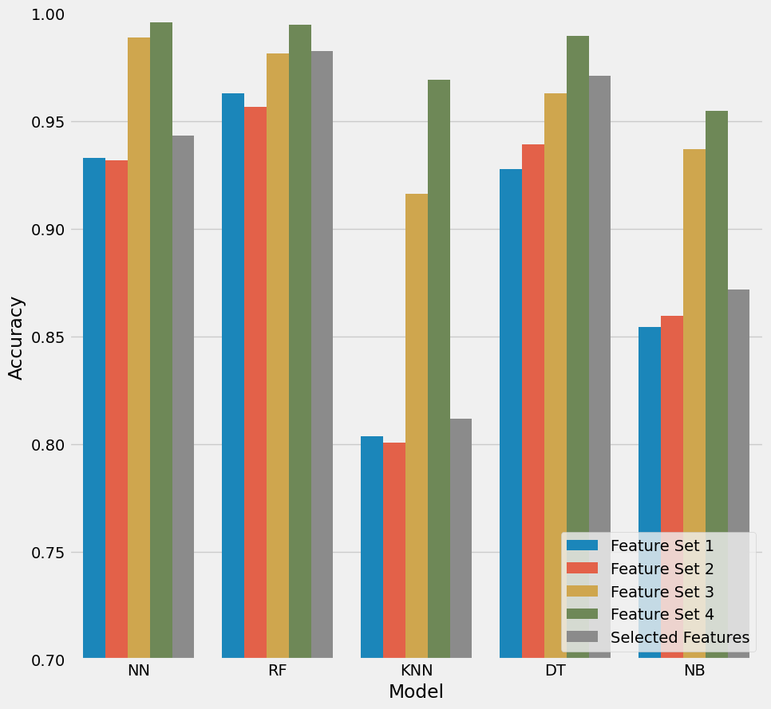

# Fitness Tracker

This collaborative project was conducted by [Kartik Walia](https://github.com/Kartik-Walia) (Branch: CSE) and [Ishita Sharma`](https://github.com/ishitasharma32) (Branch: MCE).

## Overview

This project involves the analysis of sensor data to track and evaluate physical exercises. The data includes accelerometer and gyroscope readings, aiming to predict and classify different exercise patterns.

## Installation

To set up the project, follow these steps:

1. Clone the repository:

    ```bash
    git clone https://github.com/Kartik-Walia/Fitness_Tracker.git
    cd Fitness_Tracker
    ```

2. Navigate to the project directory:

    ```bash
    cd Fitness_Tracker
    ```

3. Install the required dependencies:

    ```bash
    pip install -r requirements.txt
    ```

## Usage

The project is structured into two main parts: data preprocessing and machine learning. The data preprocessing pipeline includes outlier detection, feature engineering, and data transformation. The machine learning phase involves training and evaluating various models.

### Data Preprocessing

- **Outlier Detection**: Detecting outliers using the LOF (Local Outlier Factor) approach.
- **Feature Engineering**: Applying techniques like PCA (Principal Component Analysis), Butterworth filter, and temporal abstraction.
- **Data Transformation**: Handling missing values, interpolating, and applying rolling averages.

### Machine Learning

- **Train-Test Split**: Stratified train-test split based on labeled data.
- **Feature Selection**: Implementing forward feature selection using a decision tree.
- **Model Selection**: Utilizing a range of classifiers, including neural networks, random forests, k-nearest neighbors, decision trees, and naive Bayes.
- **Hyperparameter Tuning**: Grid search for optimal hyperparameters.

## Dataset

The dataset includes sensor readings (accelerometer and gyroscope) during various physical exercises. Data is categorized by participants, sets, and exercise labels.

## Model Selection

Among Neural Network (NN), Random Forest (RF), K-Nearest Neighbors (KNN), Decision Tree (DT), and Naive Bayes (NB), Random Forest was selected as the learning algorithm due to its superior accuracy for the given features.



## Results

Achieved an impressive accuracy of 99.586% on the test set with 4 wrong predictions in the confusion matrix.


## Acknowledgements

We would like to express our gratitude to the open-source community for valuable contributions and resources that facilitated the implementation of data transformation and temporal abstraction.

Feel free to explore the commits to understand the individual contributions made by Kartik Walia and Ishita throughout the project.